# 프로젝트 소개 (한글) | [English](./README.md)
 * 본 프로젝트는 [BELIVVR](https://belivvr.com)에서 [hubs](https://github.com/Hubs-Foundation) 프로젝트를 fork하여 추가 기능을 개발하고, Hubs의 Room, Scene의 자원들을 회원제로 별도의 회원제 클라우드로 서비스를 제공하는 것을 목표 했던 XRCLOUD(https://xrcloud.app) 오픈소스 프로젝트입니다.
 * 2025년 2월, BELIVVR는 기업의 운영이 어려워 추가 개발을 진행하지 않으므로 오픈 소스(https://github.com/luke-n-alpha/xrcloud) 로 공개 합니다.
 * 기존 개발 서비스를 해드린 파트너들을 위한 상세 문서화 서비스이며, 작게나마 웹 메타버스 오픈소스 생태계에 기여를 하기 위함입니다.
 * HubsFoundation에 별도의 PR을 보낼 여력은 없었으니 참고 바라며 XRCLOUD 서비스는 2025년 9월까지 운용할 수 있는 서버를 확보한 상황이나 이후 서비스 계획에 대해서는 확정된 바가 없습니다. 2025년 12월까지 서비스를 약속한 파트너들에게는 기술 지원을 진행합니다.
 * 추가 문의는 BELIVVR의 대표 였던 양병석 대표(luke.yang@cafelua.com)에게 문의 바랍니다.
 
# 설치 및 운용 방법 
 * 본 프로젝트는 여러 subRepository의 프로젝트에 의존성이 있습니다. XRCLOUD 프로젝트는 동일한 라이선스를 따르며, hubsFoundation에서 fork한 프로젝트는 원본 프로젝트의 라이센스를 따릅니다.
 * 상세한 설치 및 운용 방법은 [설치 및 운용 가이드](./docs/installation_guide_ko.md) 를 참고 바랍니다.
 * 기여/운영 규칙은 [Caret 규칙 (사람용 가이드)](./docs/caret-rules_ko.md)를 참고하세요.
 * 운영 현황/복구 계획은 [운영 현황](./docs/ops-status_ko.md)과 [운영 복구 계획](./docs/ops-recovery-plan_ko.md)을 참고하세요.
 * 오픈소스 문서 점검은 [오픈소스 문서 검토](./docs/oss-docs-review_ko.md)를 참고하세요.
 
# 라이선스 및 특허
* hubs를 포함한 subProject들은 각 원본 프로젝트들의 라이센스를 따릅니다.
* XRCLOUD는 Apache License 2.0을 따릅니다.
* 특허 관련 공지:
  - 이 소프트웨어의 사용이 BELIVVR의 특허권에 대한 사용 허가를 의미하지 않습니다.
  - 본 소프트웨어는 Apache 2.0 라이센스로 공개되었으나, 이는 특허 청구로부터의 완전한 면책을 제공하지 않습니다.
  - BELIVVR은 이 시스템의 특정 기능과 관련된 여러 특허를 보유하고 있습니다.
  - 특허가 적용된 기능을 상업적으로 사용하기 위해서는 별도의 특허 라이센스가 필요할 수 있습니다.
  - 특허 라이센스 문의: luke.yang@cafelua.com
* 전체 라이센스 및 특허 정보는 LICENSE와 NOTICE 파일을 참조하시기 바랍니다.


# XRCLOUD의 사용 개발 프레임 워크
 * XRCLOUD-BACKEND : Nest.js, Node.js, PostgreSQL, Docker, REDIS
 * XRCLOUD-FRONTEND : Next.js, React, TypeScript, Docker

# 주요 추가 기능 및 특징
 * XRCLOUD는 hubs의 fork 프로젝트로 hubs의 기본 기능들을 제공합니다. hubs의 admin계정 하나를 XRCLOUD를 통해 다양한 이용자들이 사용하는 구조로 hubs의 admin Project는 사용하지 않으며, XRCLOUD를 통해 hubs의 리소스를 관리합니다.

  ## 회원별 레벨 차등 관리 기능 (xrcloud) ###
   * 3rd Party 개발자의 레벨을 차등 설정하는 등급을 나누고 구독관리를 통해 차등 서비스를 할 수 있습니다.

   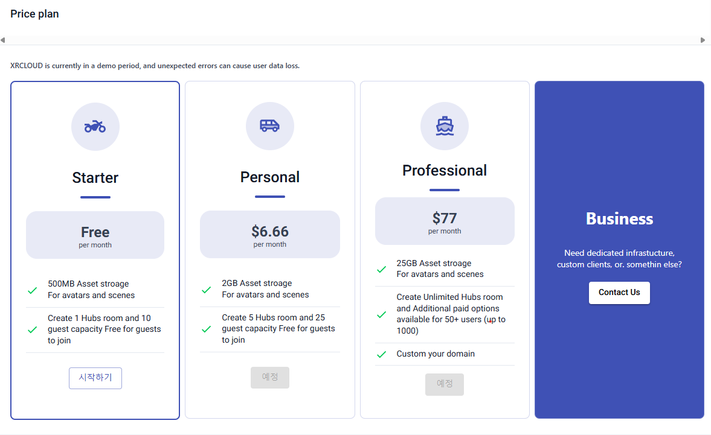
   
      * XRCLOUD프로젝트는 hubs의 기능을 확장하여 차별화된 기능을 제공하고, 회원제 클라우드 서비스를 목표했습니다.
      * 룸에 입장 수 제한, 씬과 룸의 개설 개수 제한을 둘 수 있습니다. 
      * 별도의 관리도구 개발은 못했으며 회원 가입시 default Tier에 설정이되며, DB에서 추가 Tier로 업그레이드를 해줘야 합니다.     
      * 저장공간 제한, 결제 관련한 기능은 미구현 되어있습니다.

  ## 개발자를 위한 대시보드 서비스 (xrcloud) ###
   * 이에 3rd Party의 회원, 프로젝트 관리, 메타버스공간 웹에디터에 해당하는 씬 관리, 메타버스 공간 인스턴스에 해당하는 룸 관리 기능의 대시보드 서비스를 제공합니다.   
   
   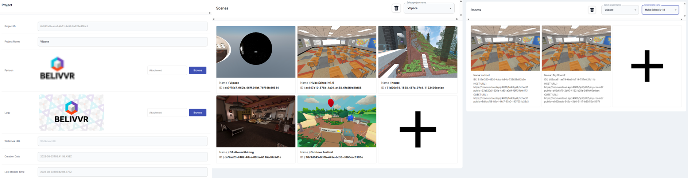


  ## 개발자를 위한 OpenAPI 서비스 (xrcloud) ###
   * 3rd Party의 프로젝트, 씬, 룸 관리를 하기 위한 API를 제공합니다.
     API에 대한 설명은 [XRCLOUD API 문서]([XRCLOUD API Documentation](https://github.com/luke-n-alpha/xrcloud-backend/docs/api/en/api.md)을 참고 바랍니다.
   * 3rdParty개발자의 플랫폼에서 별도의 유저관리를 통해 창작 플랫폼을 만들 수 있는 3rdParty의 회원에 관한 API도 제공합니다.
   * 호스트와 개스트 유저를 나누어 차등 권한을 줄 수 있습니다.
   * 만료되는 Private URL과 지속 공개 가능한 Public URL을 생성할 수 있습니다.    

   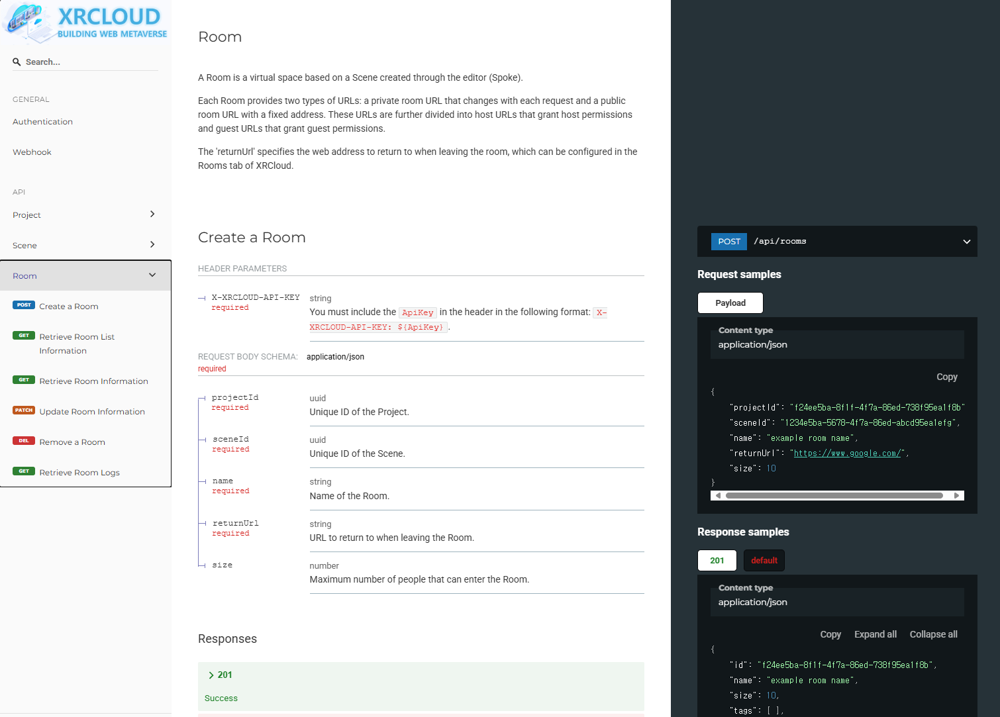
     
  ## 미디엄 블로그의 RSS페이지 랜더링 기능 (xrcloud) ###
   * 관리중인 미디엄 블로그를 서비스내에 보이게 할 수 있습니다.

    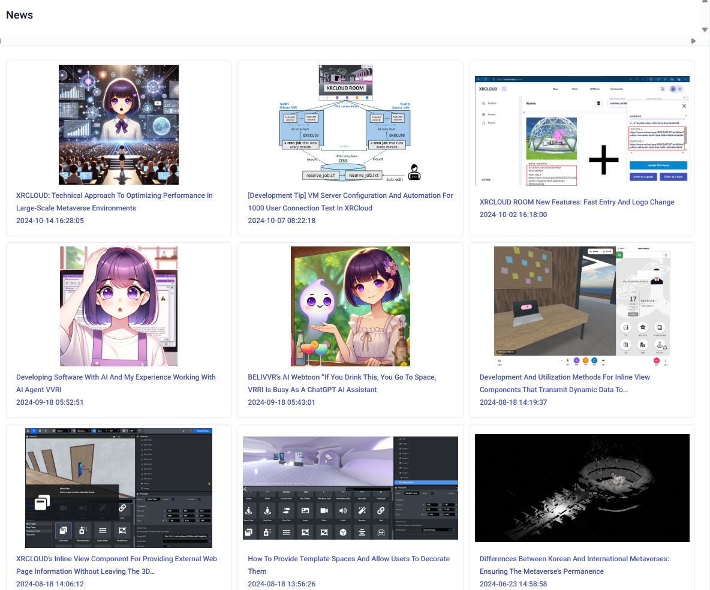

  
  ## 룸 로깅, 이벤트훅 (xrcloud) ###
   * XRCLOUD의 커스텀 hubs(hubs-all-in-one)에 룸 로깅, 이벤트훅 기능을 추가하였습니다.
     * 룸 로깅 : 룸 입장, 퇴장, 이동 등의 이벤트를 로깅합니다.
     * 이벤트훅 : 룸 입장, 퇴장, 이동 등의 이벤트를 훅하여 외부에 전달합니다.
     * 프로젝트 단위로 hook URL을 설정할 수 있습니다.     

    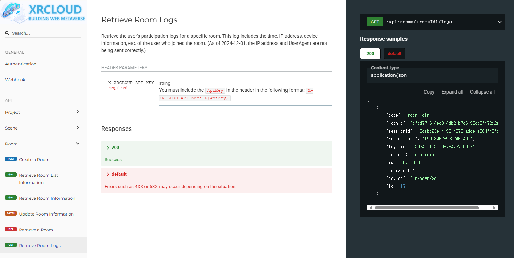


  ## 풀바디(전신) 아바타 (hubs)
  * **[BELIVVR의 오픈소스 풀바디 아바타 에디터](https://github.com/luke-n-alpha/xrcloud-avatar-editor)**  지원
    * 이 아바타 프로젝트는 Bit-ecs를 고려하여 설계되지 않아 Hubs의 모든 기능을 지원하지는는 않습니다.

     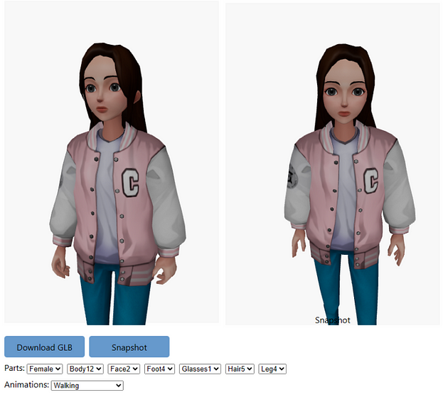

  ## 점프 (hubs)
  * 데스크톱 모드에서 J 키를 누르면 아바타가 점프합니다.
     * 참고 : 풀바디 아바타는 점프 시 y값이 지면으로 초기화되어 점프할 수 없습니다.\
   
     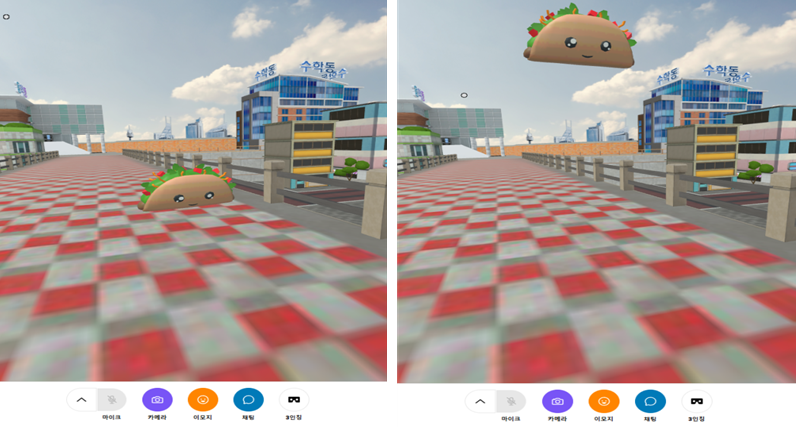
 
  ## 3인칭 자유시점 기능 (hubs)
  * 데스크톱 모드에서 3인칭 시점을 지원하며, 카메라가 아바타 뒤에 위치하고 카메라 위치를 조정할 수 있습니다. 이동 시 카메라는 아바타의 머리 뒤로 돌아가 아바타의 시점과 일치합니다. 
     * 3인칭 자유시점시 roll이 동작하여 좀 부자연스러운 면이 있습니다. 해당 부분은 시간 관계상 개선하지 못했습니다.
 
     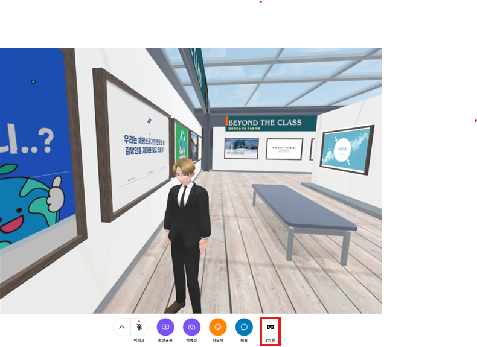

  ## 입장시 URL로 설정하는 아바타 변경 기능 (hubs) 
  *  URL 쿼리 매개변수를 통해 아바타를 변경할 수 있습니다.

  ##  빠른 입장 (hubs)
   *  기기 및 아바타 설정 모달 창을 건너뛰고 즉시 입장할 수 있습니다.
  ```
   # Avatart Setting & fastEntry use example
https://room.xrcloud.app:4000/qkoCp3x/test2?public=04f740f3-b96f-43da-90da-5c99d64e2364%
avatarUrl=https://belivvr.github.io/files/Avatars/VVRI_SD_Ani_Ribbon_ReAnimaion_04.glb&
&displayName=VVRI
&funcs=fastEntry
  ```

  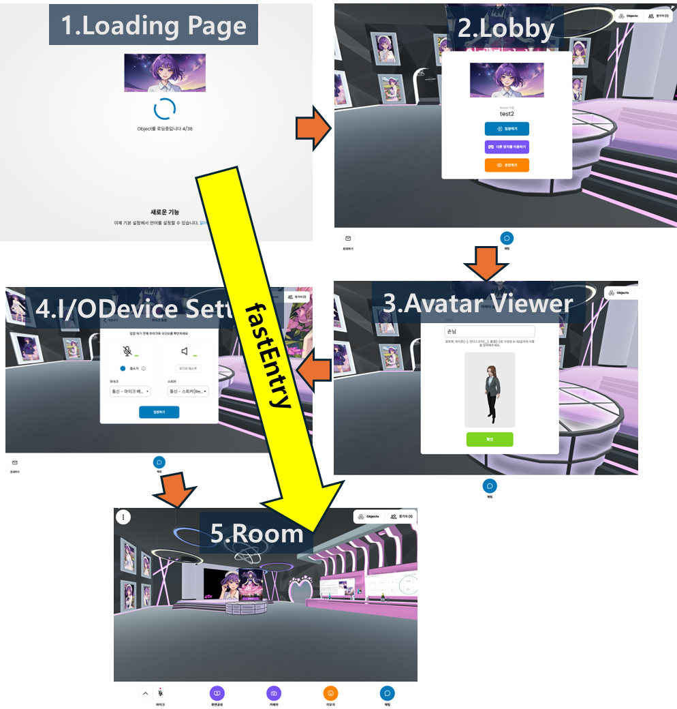

  ## 인라인 프레임/뷰 컴포넌트(Spoke/hubs): 
   * 링크 컴포넌트와 유사하지만 향상된 기능 제공하는 컴포넌트 입니다.
   * **iframe 기반 콘텐츠 뷰** : BELIVVR의 커스텀 Spoke 컴포넌트로 Hubs의 3D 메인 뷰, 채팅 사이드바, 자체 창 또는 새 창에서 콘텐츠를 표시할 수 있습니다.
      * XRCLOUD의 privateURL에는 url생성시에 미리 데이터를 전달하여, 인라인 뷰에 데이터를 전달 할 수 있습니다. 이를 통해 사용자 별로 다른 콘텐츠를 보이게 할 수 있습니다.      

  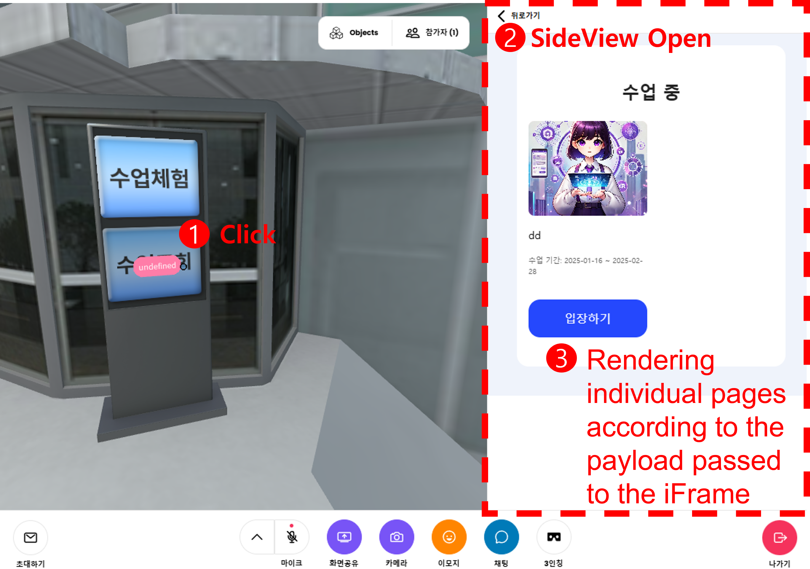 

   * **버튼 텍스트 커스터마이징** : 링크 컴포넌트와 달리 사용자가 버튼 텍스트를 수정할 수 있습니다.
    
  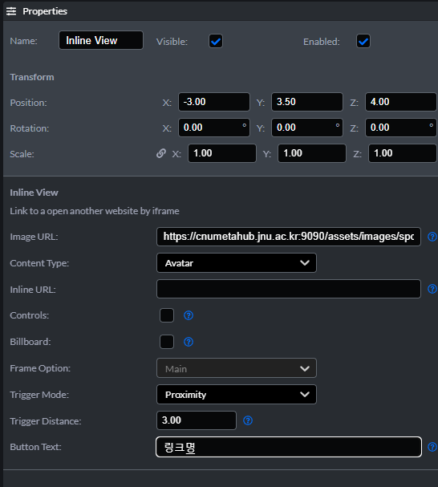     
   
   * **아바타 변경 기능** : 대상 URL에 아바타 설정을 포함하여 클릭 시 변경할 수 있습니다.
      * Spoke의 거울 컴포넌트와 함께 활용하시면 아바타 샵 등의 기능이 구현 가능합니다.
    
  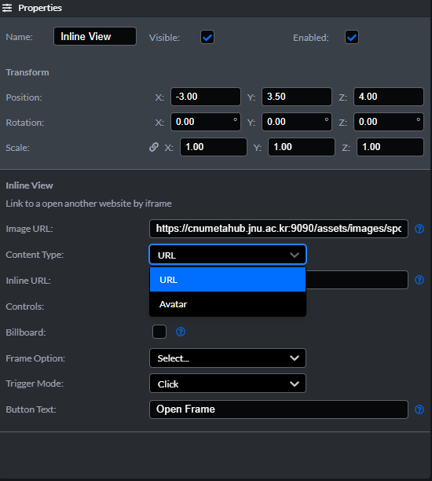     
   
   * **근접 트리거** : 지정된 거리 내에서 자동으로 활성화됩니다.      
      * 아바타 변경기능과 함께 사용하면 특정 룸에서 특정 아바타 사용을 강제할 수 있습니다.
  
  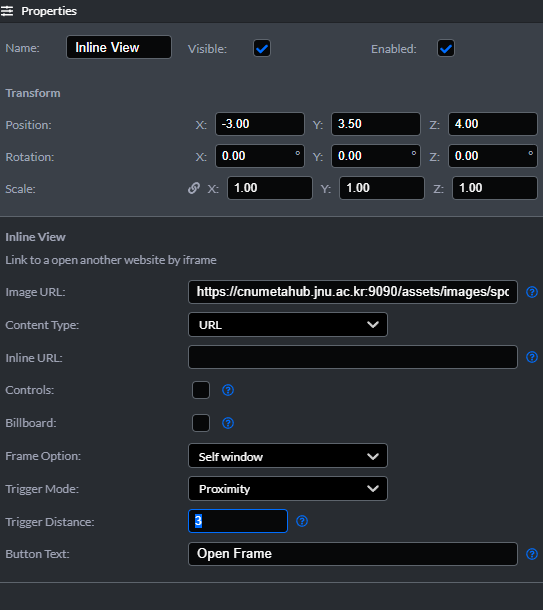     

   * **새로고침 없는 룸 이동** :링크 컴포넌트처럼 새로고침 없이 룸간 이동을 지원합니다.
      * 근접트리거와 함께 사용하면, 특정 위치에서 다른 룸으로 이동하는 자연스러운 포털 이동 기능을 구현할 수 있습니다.


 ## 적용 사례들 
* 적용 사례들에 대한 상세 페이지는 [적용 사례](./docs/applied_cases_ko.md)를 참고 바랍니다.
* [CNU메타버시티 (국립 전남대학교 메타버스)](https://cnumeta.jnu.ac.kr/) : 2022년부터 개발된 가상 캠퍼스로, 학생들의 창작 기능, 템플릿 룸을 활용한 개인 공간, 메타버스 창작 대회, 메타버스 졸업식 및 입학식 등을 제공합니다. 본 프로젝트를 개발하는데 가장 많은 도움을 받은 프로젝트였습니다.
* [메타트랙](https://meta-track.kr) : 2024년에 완성된 메타버스 교육 플랫폼으로, 교사가 수업을 생성하고 관리자가 만든 과목별 메타버스 공간과 매칭하여 메타버스 수업 등록 및 출석이 가능합니다. 
* [클래스브이](https://classv.school/ko): BELIVVR에서 개발한 메타버스 교육 프로그램 운영 플랫폼으로, 수업 생성과 학생들의 창작 콘텐츠 공유가 가능합니다.
* [순천에코넷](https://suncheoneco.net/ko/): 순천시의 메타버스 플랫폼으로, 순천만의 생태환경을 보여주고 메타버스를 활용한 어린이 환경교육 프로그램 자료를 제공합니다.

 ## 사용 가능한 공간(Scene/Spoke) 데이터 공개
 * CCL에 따라 사용가능한 공간(Scene/Spoke) 데이터는 [공간 자료](./docs/spoke_files/README_ko.md)를 참고 바랍니다.

 ## 추가 기술 문의 
 * 추가 기술 문의는 BELIVVR의 대표 였던 양병석(luke.yang@cafelua.com)에게 문의 바랍니다.
