# XRCLOUD Use Cases (English) | [한글](./applied_cases_ko.md)

# Use Cases
* These use cases can help you understand potential project implementation directions.

# 1. CNU Metacity
* Service URL: https://cnumeta.jnu.ac.kr/
* While developing Chonnam National University's metaverse campus, we focused on integrating with the university's information systems and operating metaverse events such as graduation ceremonies, entrance ceremonies, and achievement sharing meetings. As a result, we developed the following features:

## Dual Account Management for Administrators/Users
* User accounts support SSO login integrated with Chonnam National University's information system and social login. User IDs are created using email as the key.
   - Related API: https://api.xrcloud.app/docs/en/#tag/project/operation/GetXrcloudUserId
   - The API provides information about creating and querying user IDs for 3rd party services. ReticulumID is Hubs' infrastructure ID, which is the XRCLOUD user ID.

   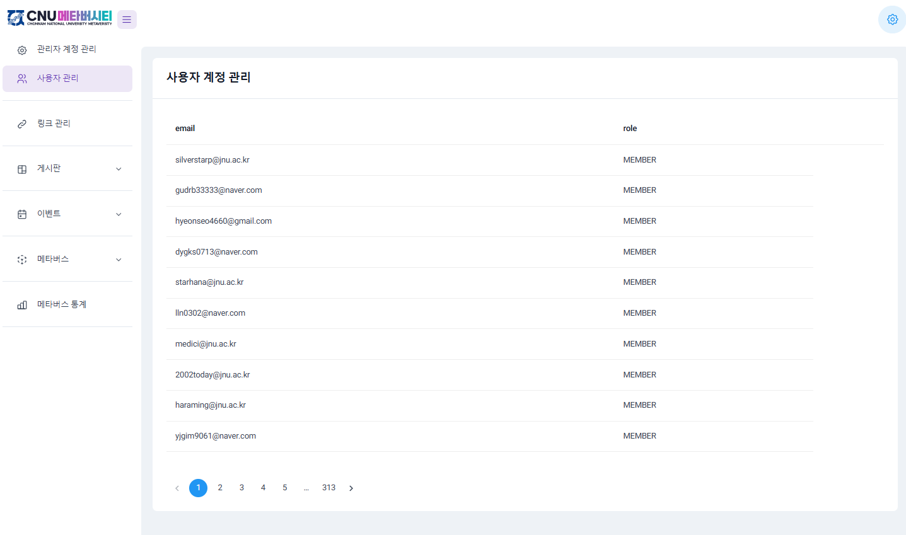

## Space Management Tools
* This is a feature for managing scenes and rooms in the admin panel.
    - CNU Metacity provided spaces in four categories: metaverse campus buildings, LMS-linked spaces, user creation spaces, and personal spaces. We developed it to manage Rooms and Scenes created through XRCLOUD in a separate DB within CNU Metacity.
    * Related API: https://api.xrcloud.app/docs/en/#tag/scene
    * Related API: https://api.xrcloud.app/docs/en/#tag/room

   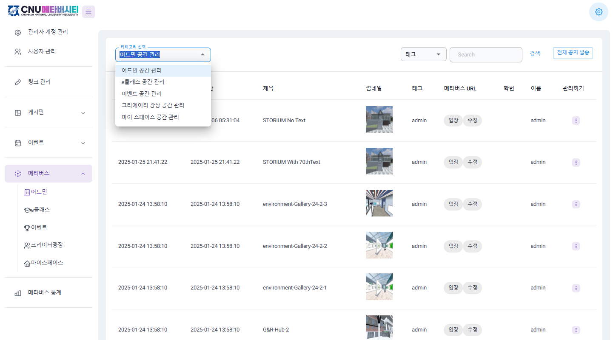

## Announcements for Individual Rooms and All Rooms
* Administrators can send announcements to individual rooms or all rooms through the admin room management tool. This feature allows sending chat announcements without entering the room.
   - As this wasn't developed into an official XRCLOUD API, separate documentation wasn't created.
   - You need to use custom APIs added in BELIVVR's reticulum project (https://github.com/luke-n-alpha/reticulum)
   - Please analyze and use the [source code](./cnu_reticulum/) in TypeScript that we've attached.

   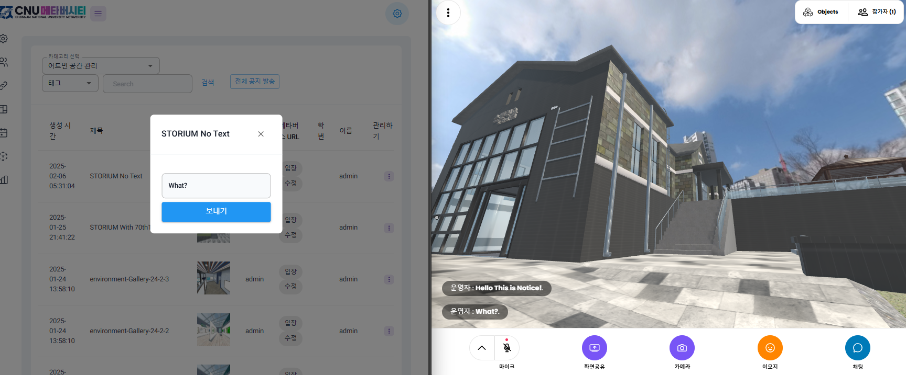

* **Event Management Feature**: We developed functionality for users to register for events running during specific periods, allowing them to engage in creative activities and share their results during the designated timeframe.
   - While the front page needed to be developed additionally as event content changes annually, we developed the backend and management tools with consistency and scalability in mind.
   - We also developed management features to display various events on the main page.

   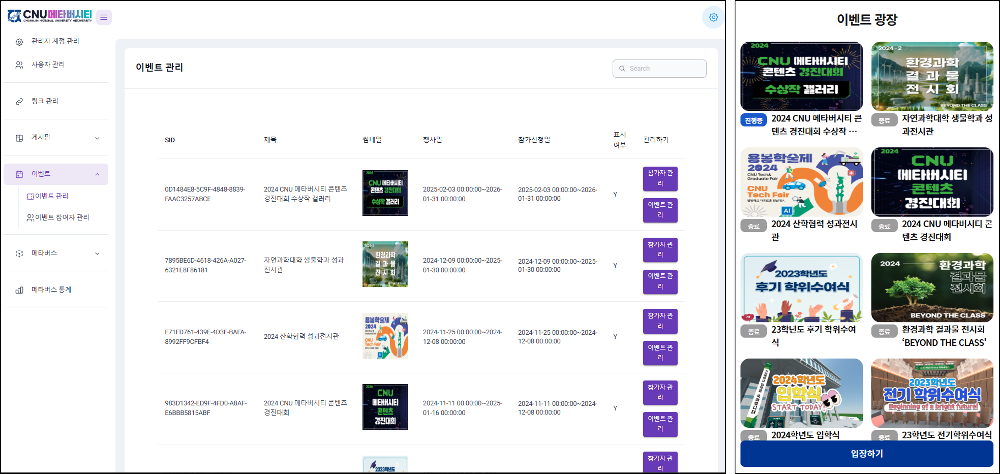

## Service Pages
* **User-specific MySpace Creation**: We created individual Rooms for users using specific SceneIDs.
   * In their personal space, users have host privileges allowing them to decorate their space by placing images and models.
   * MySpace access is through dynamically generated privateURLs from the service page, with only Host users having PIN feature privileges.
   * Related API: https://api.xrcloud.app/docs/en/#tag/room/operation/GetRoom
   * Related Post: [How to Provide Template Spaces and Allow Users to Decorate Them](https://medium.com/belivvr-en/how-to-provide-template-spaces-and-allow-users-to-decorate-them-bed384bd944f)

      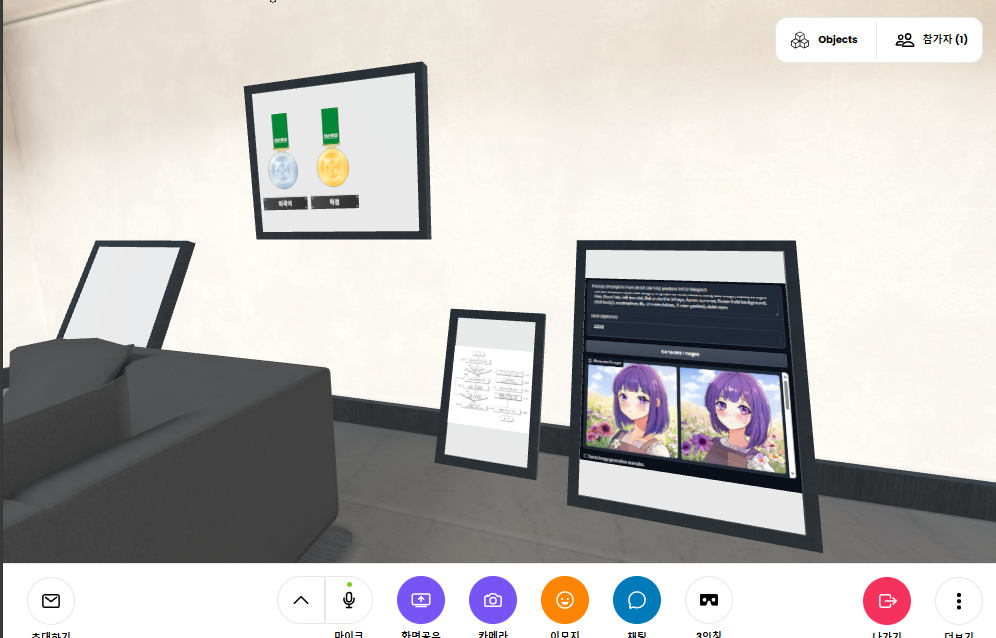

* After placing the InlineView component, we developed functionality to view student-specific academic achievements by passing student information through linkPayload in getRoomAPI.

    * Related API: https://api.xrcloud.app/docs/en/#tag/room/operation/GetRoom
    * Related Post: [XRCLOUD’s Inline View Component for Providing External Web Page Information Without Leaving the 3D Space](https://medium.com/belivvr-en/xrclouds-inline-view-component-for-providing-external-web-page-information-without-leaving-the-3d-e038b9ff4f11)

      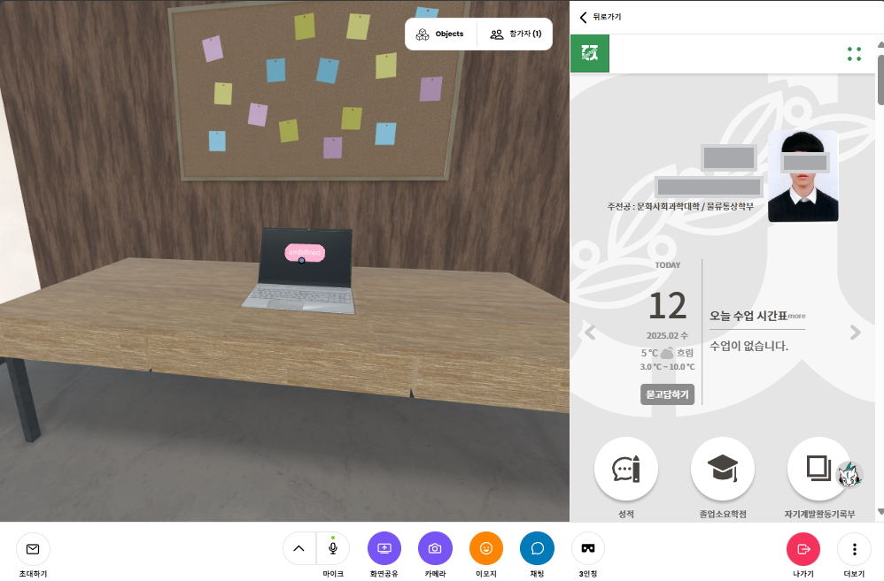

* When entering personal spaces, Medal objects are displayed differently based on each student's academic achievements.

     - As this wasn't developed into an official XRCLOUD API, separate documentation wasn't created.
   - You need to use the EmptyFrame component from BELIVVR's Spoke project (https://github.com/luke-n-alpha/spoke) and custom APIs added in BELIVVR's reticulum project (https://github.com/luke-n-alpha/reticulum)
   - Please analyze and use the [source code](./cnu_reticulum/) in TypeScript that we've attached.

     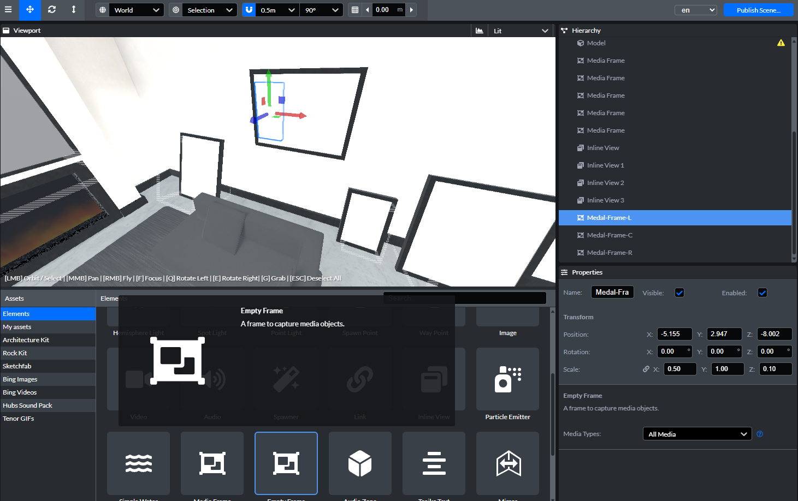
     

* Features like full-body avatars, third-person view, and jumping were continuously developed over the slightly more than three-year duration of this project. We thank Chonnam National University (https://www.jnu.ac.kr/) for supporting this project.

# 2. Meta-Track
* Service URL: https://meta-track.kr/
* Developed in 2024 with NIPA support for Korean mid-sized education companies, this educational platform allows teachers to create classes and match them with subject-specific metaverse spaces created by administrators for metaverse class registration and attendance.
* Unlike CNU Metacity which had a single organization as a client, this platform needed to serve multiple companies and integrate Unity WebGL content. It was developed to allow teachers to manage classes and match them with specific subjects and times. Student activities in both metaverse and website were stored in a single database, which data analysis companies could use to provide dashboards showing academic achievement and other metrics.

## Differentiated Permissions for Contents Provider
* Meta-Track had a Content Provider role. In XRCLOUD, contents providers should be treated the same as regular users. Implement appropriate permission controls in your service.
   - Related API: https://api.xrcloud.app/docs/en/#tag/project/operation/GetXrcloudUserId

      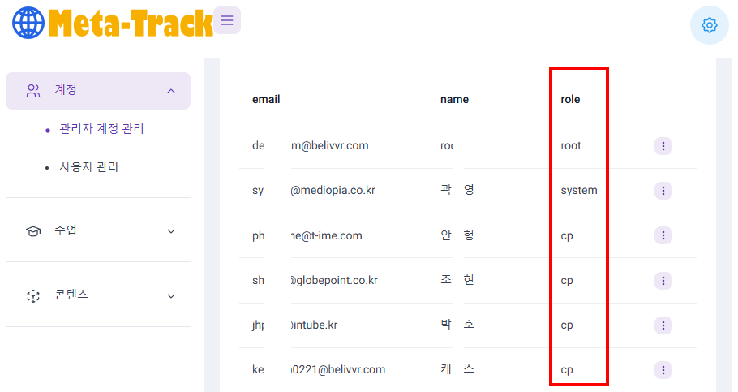

## Class Management
* Meta-Track implemented its own class management functionality as an education platform. In the metaverse platform, spaces are used as resources, and each business has its own central objects. Meta-Track, as an education platform, was developed with classes at the center, connecting spaces and user class histories. While there are various implementation methods, when using XRCLOUD API, you can record additional information using Room and Scene Tag information, but this isn't recommended considering API call speed. If you must use it, implement caching. Meta-Track managed this directly in its own DB.

    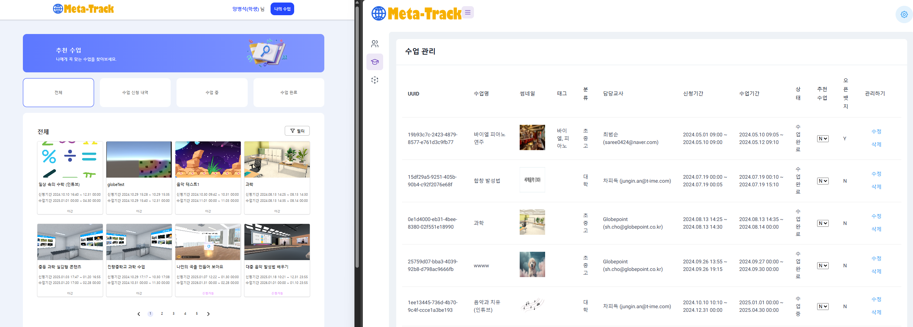

## Space Management
* Users with content manager permissions could assign subject information when creating spaces in the management tool. These spaces would then serve as class content for that subject. When creating a Scene, a Room was immediately created for use as a unique space. This is because users generally find it difficult to understand Scene as a Project concept. If users wanted to reuse that Scene, they were guided to Export as a Spoke file and create a new Scene. While we couldn't implement it due to time and cost constraints, implementing a Scene copy feature would be beneficial.
* When teachers create classes, they specify subject and time, then can select available subject spaces for that time. This is a space reservation concept, representing a scenario of virtual space rental in the metaverse.
    - Related API: https://api.xrcloud.app/docs/en/#tag/scene
    - Related API: https://api.xrcloud.app/docs/en/#tag/room

      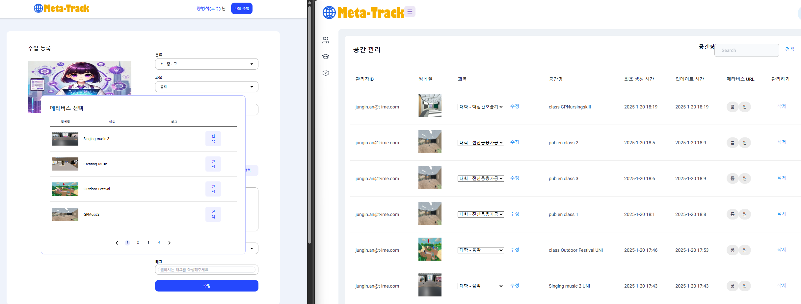

## User Information Integration with External Services Including Avatars
* Multiple companies were involved in creating metaverse educational content. This necessitated transferring user information including avatars to these services. External sites needed to render content in inline view components, so Meta-Track's site was configured with CORS settings to allow content display.
Additionally, other Unity-based content required fbx files instead of glb avatars. Since avatar part combination information wasn't stored in Meta-Track's DB, we developed a [shell script to convert entire full-body avatar glb files to fbx](./meta_track/convert_glb_to_fbx.sh). This functionality used [Open Asset Import Library (assimp)](https://github.com/assimp/assimp).

  - Related Post: [Development and Utilization Methods for Inline View Components that Transmit Dynamic Data to External Web Pages](https://medium.com/belivvr-en/development-and-utilization-methods-for-inline-view-components-that-transmit-dynamic-data-to-d0d225a935d9)

* This issue led us to consider standardizing avatar formats.

## Learning Data Analysis through User Logging ##
* XRCLOUD stores user logs and various site activities in a DB via webhook, allowing for the analysis of student learning data to suggest recommended classes.

   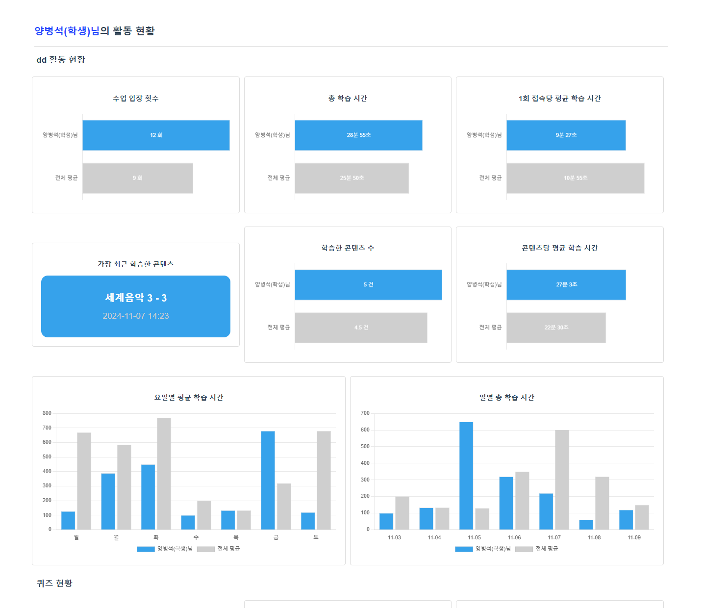

* July 29, 2024 Notice Email to Project Developers

According to Meta-Track requirements, we've modified the following:
Removed frame-specific data transmission specs and implemented uniform string data transmission to all inline view frames
Data transmitted from Meta-Track is as follows, separated by '|'
- {userId}|{name}|{avatarUrl}|{courseId}
- Please represent avatars and individuals in each app and service using name and avatarUrl
- Please send necessary logs using userId and courseId
  * Log specifications will be provided separately
```

  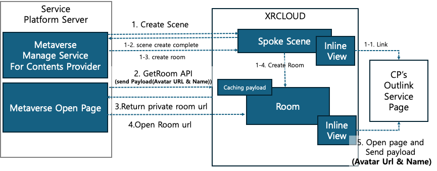

# 3. ClassV
* Service URL: https://classv.school/en
* A metaverse education program operation platform developed by BELIVVR, enabling class creation and student creative content sharing.
* Due to BELIVVR's previous business influence from VR webtoon ComicsV, ClassV operated an educational program where students created AI webtoons and exhibited them in their metaverse spaces. In Korea, it was part of the government's Digital Sapling program.
   - Related Post: [AI and metaverse education all in one, CLASSV’s first class was held in Buheung HighSchool](https://medium.com/belivvr-en/ai-and-metaverse-education-all-in-one-classvs-first-class-was-held-in-buheung-highschool-05c521146200)

  * As BELIVVR's own AI metaverse education program, it held value, and we are also releasing the [Korean version of Spoke educational materials](./classv/모질라%20허브%20교육%20자료_루크_230913.pdf).

   

# 4. Suncheon Econet
* Service URL: https://suncheoneco.net/en/
* Suncheon City's metaverse platform showcasing Suncheon Bay's ecological environment and providing metaverse-based environmental education program materials for children.
* The significance of this project lies in creating multilingual spaces and attempting to use local ecological resources to create metaverse education programs as promotional and business tools. Due to internal company circumstances leading to organizational downsizing, we were unable to provide additional program development support for the local organization.
* We recorded multilingual audio docent for exhibitions, and the metaverse spaces were designed using offline symbolic objects.
* As our business operations end, it's unclear whether the site will continue operating beyond mid-2025, so we are releasing the project's Spoke files, resource files, and Korean educational materials for reference.

   - [Suncheon Econet 5000 Green Square Scene Data](./spoke_files/data/scene_5000green_square/)
   - [Suncheon Econet English Exhibition Hall Scene Data](./spoke_files/data/scene_exhibition_hall_en/)
   - [Suncheon Econet Korean Exhibition Hall Scene Data](./spoke_files/data/scene_exhibition_hall_ko/)
   - [Suncheon Econet Educational Materials](./suncheon_econet_education_resources_ko/)
   - Related Post: [Suncheon, a city that lives with nature, meets the world in a metaverse](https://medium.com/belivvr-en/suncheon-a-city-that-lives-with-nature-meets-the-world-in-a-metaverse-7190dfd4910a)

     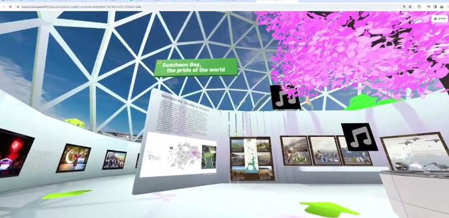

# 5. Appendix
* [Public Spoke Spaces Available on XRCLOUD](./spoke_files/README.md)

# 6. Conclusion
* BELIVVR first encountered Hubs and began operations around September 2022, during the COVID-19 pandemic. After conducting metaverse events through the COMINGM project with Korea's Hyundai Department Store Group, we planned and developed the XRCLOUD service. While it wasn't a short period, commercialization was delayed due to internal circumstances, and BELIVVR's business operations came to an end. Hoping that our projects would contribute to the popularization and development of web metaverse technology, we open-sourced XRCLOUD and created technical documentation. We thank everyone who conducted and supported wonderful projects with BELIVVR.
