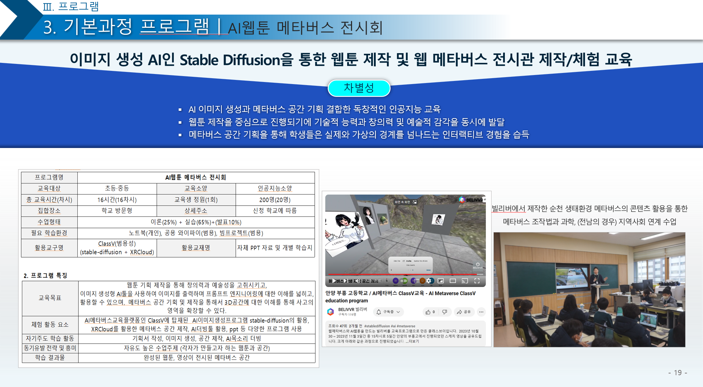

# XRCLOUD 적용 사례 (한글) | [English](./applied_cases_en.md)

# 적용 사례들
 * 적용 사례들을 참고하시면 프로젝트의 적용 방향을 확인하실 수 있습니다.
# 1. CNU메타버시티
 * 서비스 URL : https://cnumeta.jnu.ac.kr/
 * 국립전남대학교 메타버스 캠퍼스를 개발하면서 중점적으로 개발한 기능은 대학교의 정보시스템과의 연계 작업과 학위수여식, 입학식, 성과공유회 같은 메타버스를 이용한 이벤트 행사들의 운용이었습니다. 때문에 아래와 같은 기능들을 개발했습니다.


## 관리자 / 사용자 계정의 2원화된 계정관리
 * 사용자 계정은 전남대학교 정보시스템, 소셜 로그인과의 연동된 SSO로그인을 지원합니다. 이메일을 Key로 하여 유저 아이디를 생성해서 사용합니다.
   - 관련 API : https://api.xrcloud.app/docs/ko/#tag/project/operation/GetXrcloudUserId 
   - API는 3rdParty 서비스의 사용자 아이디 생성과 조회에 관한 정보를 제공합니다. ReticulumID는 hubs의 인프라ID로 XRCLOUD의 사용자ID입니다.
 
   

## 공간 관리도구
 * 어드민에서 씬과 룸을 관리하는 기능입니다.
    - CNU메타버시티는 메타버스 캠퍼스 건물, LMS와 연동된 공간, 사용자 창작 공간, 사용자의 개인공간의 4가지 카테고리의 공간들을 제공했습니다. XRCLOUD를 통해 생성한 Room과 Scene을 CNU메타버시티에서 별도 DB로 관리 하도록 개발했습니다.
    * 관련 API : https://api.xrcloud.app/docs/ko/#tag/scene
    * 관련 API : https://api.xrcloud.app/docs/ko/#tag/room

   


 ## 룸 별, 전체 룸에 대한 공지사항 전달
  * 어드민의 룸 관리도구 및 룸 별 전체 룸에 관리자가 공지사항을 보낼 수 있습니다. 룸에 입장하지 않고 채팅으로 공지사항을 보내는 기능입니다. 
   - XRCLOUD의 공식 API개발까지는 진행하지 못하여 별도의 문서는 작성하지 않았습니다.
   - BELIVVR의 reticulum 프로젝트(https://github.com/luke-n-alpha/reticulum)에서 추가한 커스텀 API를 이용해야 합니다.
   - 관련한 TypeScript의 소스를 첨부 드리니 사용하실 분들을 해당 [소스코드](./cnu_reticulum/)를 분석해서 사용하시기 바랍니다.
   
     

 * **이벤트 관리 기능** : 특정 기간동안 진행하는 이벤트에 참가 신청을 하고, 일정 기간동안 해당 사용자들만 창작 활동을 진행하고 창작결과를 공유하는 기능을 개발하였습니다. 
   - 매년 이벤트의 내용이 변경이 있으므로 프론트 페이지는 추가로 개발하도록 하였지만, 백엔드와 관리 도구는 일관성과 확장성이 있도록 개발하였습니다.
   - 또한 다양한 이벤트들은 메인페이지에 표시할 수 있도록 하는 관리 기능을 개발했습니다.

   


 ## 서비스 페이지
 * **유저별 마이스페이스 생성** : 특정 SceneID를 이용하여 유저별 Room을 생성해 주었습니다.
   * 나의 공간에서는 host권한을 가지므로 자신의 공간에 이미지나 모델을 배치하여 꾸밀 수 있도록 하였습니다. 
   * 마이스페이스 접근은 서비스페이지에서 privateURL을 동적으로 생성해서 접근하며 Host유저만 고정(PIN)기능의 이용권한을 가집니다.
   * 관련 API : https://api.xrcloud.app/docs/ko/#tag/room/operation/GetRoom
   * 관련 포스팅 : [템플릿 공간을 제공하고 사용자가 공간을 꾸미는 방법](https://medium.com/belivvr/xrcloud%ED%8C%81-%ED%85%9C%ED%94%8C%EB%A6%BF-%EA%B3%B5%EA%B0%84%EC%9D%84-%EC%A0%9C%EA%B3%B5%ED%95%98%EA%B3%A0-%EC%82%AC%EC%9A%A9%EC%9E%90%EA%B0%80-%EA%B3%B5%EA%B0%84%EC%9D%84-%EA%BE%B8%EB%AF%B8%EA%B2%8C-%ED%95%98%EB%8A%94-%EB%B0%A9%EB%B2%95-fd6905e3aace)
            

 * InlineView 컴포넌트를 배치후 getRoomAPI에서 linkPayload에 학생 정보를 전달하고, 이를 기반으로 학생별 학업 성취도를 볼 수 있도록 개발하였습니다.
        
    * 관련 API : https://api.xrcloud.app/docs/ko/#tag/room/operation/GetRoom 
    * 관련 포스팅 : [3D공간을 벗어나지 않고 외부 웹페이지의 정보를 제공하는 XRCLOUD의 인라인 뷰컴포넌트](   https://medium.com/belivvr/xrcloud%ED%8C%81-3d%EA%B3%B5%EA%B0%84%EC%9D%84-%EB%B2%97%EC%96%B4%EB%82%98%EC%A7%80-%EC%95%8A%EA%B3%A0-%EC%99%B8%EB%B6%80-%EC%9B%B9%ED%8E%98%EC%9D%B4%EC%A7%80%EC%9D%98-%EC%A0%95%EB%B3%B4%EB%A5%BC-%EC%A0%9C%EA%B3%B5%ED%95%98%EB%8A%94-xrcloud%EC%9D%98-%EC%9D%B8%EB%9D%BC%EC%9D%B8-%EB%B7%B0%EC%BB%B4%ED%8F%AC%EB%84%8C%ED%8A%B8-39d8dedd3dfa)

            


* 나의 공간으로 들어가면 학생별로 학업 성취도에 따라 Medal object를 다르게 표현하도록 하였습니다. 
     
     - XRCLOUD의 공식 API개발까지는 진행하지 못하여 별도의 문서는 작성하지 않았습니다.
   - BELIVVR의 Spoke프로젝트(https://github.com/luke-n-alpha/spoke)에서 제공하는 EmptyFrame 컴포넌트와 BELIVVR의 reticulum 프로젝트(https://github.com/luke-n-alpha/reticulum)에서 추가한 커스텀 API를 이용해야 합니다.
   - 관련한 TypeScript의 소스를 첨부 드리니 사용하실 분들을 해당 [소스코드](./cnu_reticulum/)를 분석해서 사용하시기 바랍니다.      

             
           

* 그 외에 전신아바타, 3인칭뷰, 점프 등의 기능이 3년이 조금 넘는 기간동안 진행한 본 프로젝트의 일환으로 지속 개발 될 수 있었습니다. 본 프로젝트를 지원해주신 전남대학교(https://www.jnu.ac.kr/) 에 감사를 드립니다.

# 2. 메타트랙
 * 서비스 URL : https://meta-track.kr/  
 * 2024년 한국의 중견 교육 기업들의 NIPA의 지원을 받아 개발했던 교육 플랫폼으로, 교사가 수업을 생성하고 관리자가 만든 과목별 메타버스 공간과 매칭하여 메타버스 수업 등록 및 출석이 가능합니다.
 * 1개의 조직이 고객이었던 전남대학교와 달리 여러 기업들이 이용할 수 있는 플랫폼으로 Unity WebGL콘텐츠의 연동해야 하는 일이 있었고, 교사가 수업을 관리하고 특정 과목과 시간에 매칭하는 구조로 개발했고, 학생의 메타버스와 사이트의 활동 정보를 하나의 데이터베이스에 담고, 이를 데이터 분석기업에서 이용하여 학업성취도와 같은 대시보드를 제공하는 것을 목표 했습니다.

## 콘텐츠 관리자의 차등 권한 부여 ##
 * 메타트랙에는 콘텐츠 관리자(Contents Provider)의 역할이 있었습니다. XRCLOUD에서는 콘텐츠 관리자도 일반 유저와 동일하게 취급하시면 됩니다. 서비스에서 권한범위를 적절히 제어하여 구현하시면 됩니다.
   - 관련 API : https://api.xrcloud.app/docs/ko/#tag/project/operation/GetXrcloudUserId 

              


## 수업 관리 ##
 * 메타트랙에서는 교육플랫폼으로서 자체 수업관리 기능을 구현했습니다. 메타버스 플랫폼에서 공간은 리소스로 사용되고 각 비즈니스별로 중점이 되는 객체는 별도로 존재합니다. 메타트랙은 교육 플랫폼으로서 수업이 중심이 되어 공간과 사용자 수업 이력등이 연결되는 구조로 개발되었습니다. 구현 방법은 여러가지가 있을 수 있으나 XRCLOUD의 API를 이용시에는 Room과 Scene의 Tag정보를 이용하여 부가 정보를 기록할 수 있습니다만 API호출 속도를 생각하면 추천하기는 어렵습니다. 꼭 사용하신다면 캐싱을 하시고, 메타트랙은 자체 DB에서 직접 관리하였습니다.
    
              

## 공간 관리 ##
 * 콘텐츠 관리자 권한을 가진 이용자는 관리도구에서 공간을 제작시 과목 정보를 부여하게 했습니다. 해당 공간은 해당 과목에 대한 수업 콘텐츠에 해당되게 됩니다. Scene생성시 Room을 즉시 생성하게 하여 고유 공간으로 이용하게 했습니다. 일반적으로 사용자들 입장에서는 Scene이 Project라는 개념을 이해하기 어렵기 때문입니다. 해당 Scene을 다시 이용하고 싶은 경우에는 Spoke파일로 Export후 다시 새로운 Scene을 만들어 이용하도록 가이드했습니다. 시간과 비용상 진행하지 못했으나 Scene복사 기능을 구현해주시는 것도 좋을것 같습니다.
 * 교사는 수업 개설 시, 과목과 시간을 지정하면 해당 시간에 사용가능한 과목의 공간을 선택할 수 있습니다. 일종의 공간의 예약 개념으로, 메타버스에서 가상 공간 대여의 시나리오라고 할 수 있습니다.
    - 관련 API : https://api.xrcloud.app/docs/ko/#tag/scene
    - 관련 API : https://api.xrcloud.app/docs/ko/#tag/room

              


## 외부 서비스에 아바타를 포함한 사용자 정보 연계 ##
 * 메타버스 교육 콘텐츠 제작은 여러 기업에서 진행하였습니다. 이 때문에 해당 서비스에 아바타를 포함한 사용자 정보를 전달해야 할 필요가 있었습니다. 각 외부 사이트에서는 인라인뷰 컴포넌트에서 콘텐츠를 랜더링 해야했기 때문에 메타트랙 사이트에 CORS설정을 통해 콘텐츠를 표기할 수 있도록 했습니다.
  또한 Unity로 처리하는 다른 콘텐츠에서는 glb아바타가 아닌 fbx파일을 사용해야 했습니다. 아바타의 파츠 조합 정보는 메타트랙 DB에 저장하고 있지 않았기 때문에 전신아바타의 [glb파일전체를 fbx로 변환하는 셸스크립트](./meta_track/convert_glb_to_fbx.sh)를 개발했습니다. 해당 기능을 위해서는 [Open Asset Import Library (assimp)](
 https://github.com/assimp/assimp)를 이용하였습니다.
 
  -  관련 포스팅 : [외부 웹페이지에 동적 데이터를 전달할 수 있는 인라인뷰 컴포넌트의 개발 및 활용 방법](https://medium.com/belivvr/xrcloud%ED%8C%81-%EC%99%B8%EB%B6%80-%EC%9B%B9%ED%8E%98%EC%9D%B4%EC%A7%80%EC%97%90-%EB%8F%99%EC%A0%81-%EB%8D%B0%EC%9D%B4%ED%84%B0%EB%A5%BC-%EC%A0%84%EB%8B%AC%ED%95%A0-%EC%88%98-%EC%9E%88%EB%8A%94-%EC%9D%B8%EB%9D%BC%EC%9D%B8%EB%B7%B0-%EC%BB%B4%ED%8F%AC%EB%84%8C%ED%8A%B8%EC%9D%98-%EA%B0%9C%EB%B0%9C-%EB%B0%8F-%ED%99%9C%EC%9A%A9-%EB%B0%A9%EB%B2%95-b815cc795baf)


 * 관련 이슈로 인해 아바타의 표준 포맷에 대해 고민해보는 계기가 되었습니다.

## 사용자 로깅에 의한 학습데이터 분석 ##
 * XRCLOUD에서 webhook으로 사용자 로그와 사이트의 각종 활동을 DB에 저장하고, 이 DB를 기반으로 학생들의 학습 데이터 분석을 진행하여 추천 수업을 제시할 수 있도록 하였습니다.
 
        
  

```
* 2024년 7월 29일 프로젝트 개발사들에 대한 공지 메일

메타트랙의 요구사항에 따라 내용을 아래와 같이 변경 했습니다.
프레임별로 데이터를 전달하는 스펙을 제거하고 모든 인라인뷰 프레임에 동일 스트링 데이터 전달
메타트랙에서 전달할 데이터는 아래와 같음 '|'로 구분되어 전달 함
- {userId}|{name}|{avatarUrl}|{courseId}
- name, avatarUrl을 통해 각 앱과 서비스에서 아바타와 개인을 표현 부탁드립니다.
- userId, courseId를 통해 필요한 로그를 발송 부탁드립니다.
  * 로그 스펙은 따로 안내 드리겠습니다.
```

      


## 3. 클래스브이
 * 서비스 URL : https://classv.school/ko
 * BELIVVR에서 개발한 메타버스 교육 프로그램 운영 플랫폼으로, 수업 생성과 학생들의 창작 콘텐츠 공유가 가능합니다.
 * 클래스브이는 빌리버의 전신이었던 VR웹툰 코믹스브이의 비즈니스 영향으로 AI웹툰을 제작하고 이를 각자의 메타버스 공간에 전시 하는 교육 프로그램을 운영했습니다. 한국에서는 정부 정책으로 진행하였던 디지털새싹 프로그램의 일환으로도 진행되었습니다. 
   - 관련 포스팅 : [AI와 메타버스 교육을 한번에, 안양 부흥고에서 클래스브이의 첫번째 수업이 있었습니다.](https://medium.com/belivvr/ai%EC%99%80-%EB%A9%94%ED%83%80%EB%B2%84%EC%8A%A4-%EA%B5%90%EC%9C%A1%EC%9D%84-%ED%95%9C%EB%B2%88%EC%97%90-%EC%95%88%EC%96%91-%EB%B6%80%ED%9D%A5%EA%B3%A0%EC%97%90%EC%84%9C-%ED%81%B4%EB%9E%98%EC%8A%A4%EB%B8%8C%EC%9D%B4%EC%9D%98-%EC%B2%AB%EB%B2%88%EC%A7%B8-%EC%88%98%EC%97%85%EC%9D%B4-%EC%9E%88%EC%97%88%EC%8A%B5%EB%8B%88%EB%8B%A4-1e63ec3b86e4)

  * BELIVVR에서 개발했던 자체 AI메타버스 교육 프로그램으로서 가치가 있었으며 관련한 [한글버전의 Spoke교육 자료](./classv/모질라%20허브%20교육%20자료_루크_230913.pdf)를 함께 공개합니다. 

         


## 4. 순천에코넷
 * 서비스 URL : https://suncheoneco.net/ko/
 * 순천시의 메타버스 플랫폼으로, 순천만의 생태환경을 보여주고 메타버스를 활용한 어린이 환경교육 프로그램 자료를 제공합니다.
 * 해당 프로젝트를 진행하면서는 다국어로 된 공간을 제작 했다는데 의의가 있으며, 지역의 생태자원을 활용하여 메타버스 교육 프로그램을 만들어 홍보와 사업의 수단으로 만들려는 시도를 했었습니다. 이후에 기업 내부 사정으로 조직축소로 인해 지역 조직의 운용이 어려워 해당 프로그램을 추가 개발지원 하지는 못했습니다.
 * 다국어로 전시물에 음성 도슨트로 녹음을 진행했고, 메타버스 공간은 오프라인에 있는 상징물을 이용하여 디자인 했습니다. 
 * 저희의 사업종료로 향후에 2025년 중순 이후에는 해당 사이트의 운영이 지속 할 수 있을지 불분명 하므로 해당 프로젝트의 Spoke파일과 리소스 파일, 한국어로된 교육 자료를 함께 공개하오니 참고 바랍니다.
  
   - [순천에코넷 오천 그린광장 Scene 데이터](./spoke_files/data/scene_5000green_square/)
   - [순천에코넷 영문 전시관 Scene 데이터](./spoke_files/data/scene_exhibition_hall_en/)
   - [순천에코넷 한국어 전시관 Scene데이터](./spoke_files/data/scene_exhibition_hall_ko/)
   - [순천에코넷 교육자료](./suncheon_econet_education_resources_ko/)
   - 관련 포스팅 : [자연과 함께 살아가는 도시, 순천을 메타버스에서 만나보세요.](https://medium.com/belivvr/%EC%88%9C%EC%B2%9C%EC%97%90%EC%BD%94%EB%84%B7-%EC%9E%90%EC%97%B0%EA%B3%BC-%ED%95%A8%EA%BB%98-%EC%82%B4%EC%95%84%EA%B0%80%EB%8A%94-%EB%8F%84%EC%8B%9C-%EC%88%9C%EC%B2%9C%EC%9D%84-%EB%A9%94%ED%83%80%EB%B2%84%EC%8A%A4%EC%97%90%EC%84%9C-%EB%A7%8C%EB%82%98%EB%B3%B4%EC%84%B8%EC%9A%94-dab2b5a7f0e9)

           

# 5. 부록
 *  [XRCLOUD에서 이용 가능한 Spoke 공개 공간 자료](./spoke_files/README_ko.md)

# 6. 맺음말
 * BELIVVR에서 Hubs를 처음만나 사업을 진행 한 것은 코로나 바이러스가 휩쓸던 2022년 9월경이었습니다. 한국의 현대백화점그룹의 COMINGM 프로젝트를 통해 메타버스 이벤트를 진행 후 XRCLOUD서비스를 기획하고 개발을 진행했습니다. 작지 않은 시간이었지만 내부 사정으로 상용화까지는 시간이 지연되었고, BELIVVR의 사업을 종료하게 되었습니다. 그 동안 진행했던 프로젝트들이 웹메타버스 기술 대중화와 발전에 조금이라도 도움이 되길 바라는 마음에 XRCLOUD를 오픈소스화 하였고, 기술 문서들을 작성해두었습니다. BELIVVR와 함께 멋진 프로젝트를 진행하고 지원해주신 분들께 감사를 드립니다.