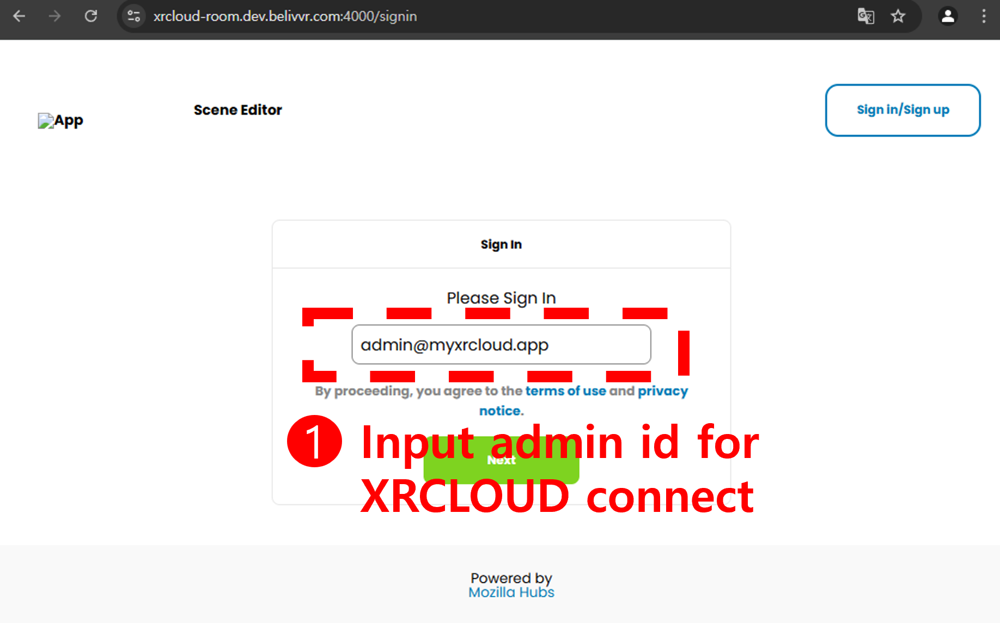
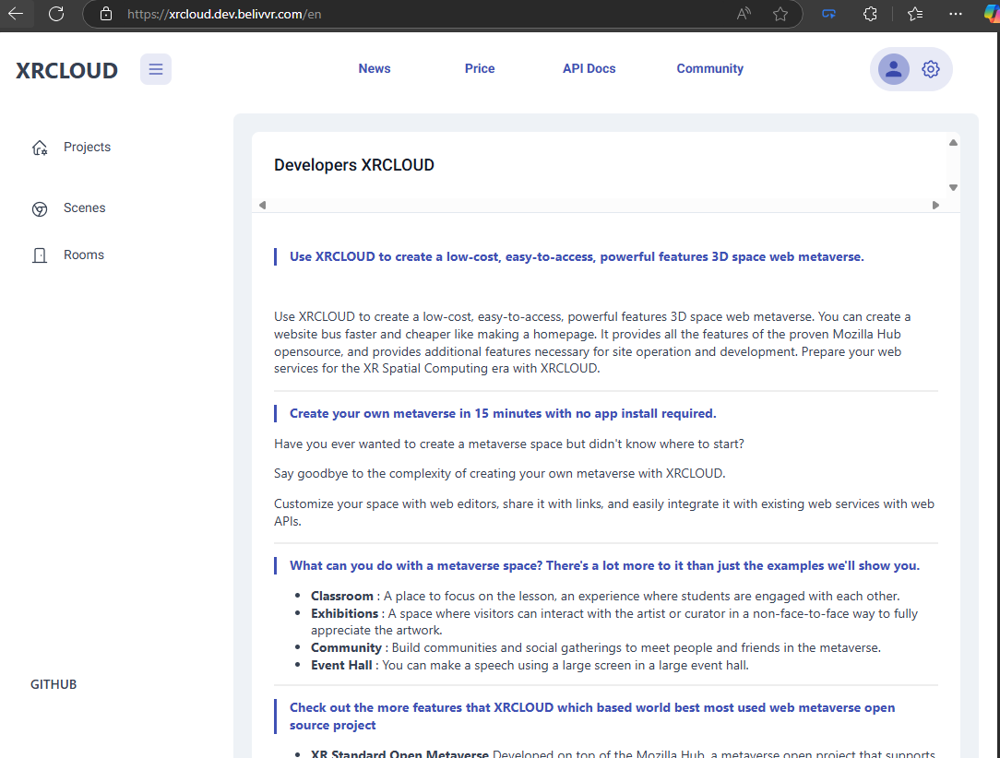
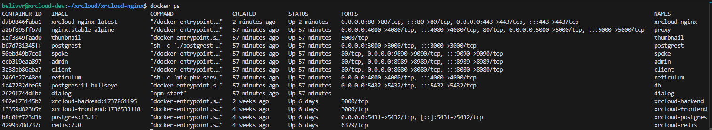

# 설치 및 운용 가이드 (한글) | [English](./installation_guide_en.md)

# 프로젝트 설명
 * 본 프로젝트는 [BELIVVR](https://belivvr.com)에서 [hubs](https://github.com/Hubs-Foundation) 프로젝트를 fork하여 추가 기능을 개발하고, Hubs의 Room, Scene의 자원들을 회원제로 별도의 회원제 클라우드로 서비스를 제공하는 것을 목표 했던 XRCLOUD(https://xrcloud.app) 오픈소스 프로젝트로 해당 프로젝트입니다.
 * 2025년 2월, BELIVVR는 기업의 운영이 어려워 추가 개발을 진행하지 않으므로 오픈 소스로 공개 합니다.
 * 기존 개발 서비스를 해드린 파트너들을 위한 상세 문서화 서비스이며, 작게나마 웹 메타버스 오픈소스 생태계에 기여를 하기 위함입니다.
 * HubsFoundation에 별도의 PR을 보낼 여력은 없었으니 참고 바라며 XRCLOUD 서비스는 2025년 9월까지 운용할 수 있는 서버를 확보한 상황이나 이후 서비스 계획에 대해서는 확정된 바가 없습니다. 2025년 12월까지 서비스를 약속한 파트너들에게는 기술 지원을 진행합니다.
 * 추가 문의는 BELIVVR의 대표 였던 양병석 대표(luke.yang@cafelua.com)에게 문의 바랍니다.

# 본 문서의 성격
 * XRCLOUD프로젝트의 설치 및 운용 가이드를 안내 합니다.

# 프로젝트의 구조와 특징
 * 3D웹 오픈소스 메타버스 프로젝트인 hubs(https://github.com/Hubs-Foundation)의 소스를 수정한 hubs-all-in-one 프로젝트는 hubs의 기능들을 담당합니다.
 * XRCLOUD 프로젝트는 hubs의 리소스를 관리하기 위한 클라우드 인프라 서비스입니다.
 * 모든 프로젝트는 Docker 컨테이너로 구동됩니다.
 * dev환경과 prod환경의 두 환경을 운용하도록 설계되어있습니다.
 * 대부분의 Linux 환경에서 동작합니다.
 * Database는 Docker로 직접 설치해서 사용하므로 별도의 외부 Database를 사용하지 않습니다.
 * Storage는 확장과 백업을 위해 NAS나 OSS사용을 권장합니다.

# 사전 준비 
 * 리눅스 계열 서버 환경 : 2코어 이상, 4GB 이상의 메모리를 권장합니다. 
 * 도메인 : 외부에서 접속할 수 있는 도메인을 준비합니다. 
    - XRCLOUD 서비스 도메인, XRCLOUD API 서버 도메인, hubs서비스 도메인 3개를 가정하여 개발되어있습니다.
    - 도메인을 한개로 사용할 경우, nginx 설정을 변경하여 사용하실 수 있습니다.
 * SSL인증서 : 도메인에서 사용가능한 SSL인증서를 준비합니다.
    - hubs ROOM은 WebRTC 서비스를 이용하므로 반드시 SSL인증서를 사용해야 합니다.
 
# Git Repository 에서 Sub프로젝트 다운로드
 * 아래의 명령어를 실행하면 필요한 git repository를 복사합니다.

```
./initial-git-clone.sh
```
 * 다운로드된 레파지토리들은 아래와 같습니다.

## XRCLOUD 프로젝트
 ### XRCLOUD 백엔드 프로젝트 
  * API다큐먼트와 백앤드 API를 담당합니다. Nest.js 프레임 워크로 개발되었습니다.
  * Repository : https://github.com/belivvr/xrcloud-backend.git
 
 ### XRCLOUD 프론트엔드 프로젝트
  * XRCLOUD의 대시보드와 같은 프론트 서비스를 담당합니다. Next.js 프레임 워크로 개발되었습니다.
  * Repository : https://github.com/belivvr/xrcloud-frontend.git

 ### XRCLOUD NGINX 프로젝트
  * XRCLOUD의 네트워크 서비스를 담당합니다. NGINX로 개발되어 있으며, 외부의 억세스와 내부의 Docker컨테이너들을 연결하는 역할을 합니다.
  * Repository : https://github.com/belivvr/xrcloud-nginx.git
 
## Hubs 프로젝트
  ### Hubs All in One 프로젝트
   * Hubs와 관려된 Docker들의 전체 설치, 운용 등을 담당합니다.
   * 설치에 필요한 환경설정 파일을 만들고, 설치/배포를 할 수 있습니다.
   * https://github.com/belivvr/hubs-all-in-one.git
  
  ### Dialog 프로젝트
   * Dialog 프로젝트는 Hubs의 WebRTC 서비스를 담당하여 SFU방식으로 사용자의 룸 접속과 네트워크 중계를 담당합니다. Mediasoup기반으로 개발되어있습니다.
   * 수평확장에 관련한 개발을 진행하지 못해 한계가 있지만 사용자 증가를 고려하여 Hubs프로젝트에서 별도의 서버에서 실행할 수 있습니다.
   * https://github.com/belivvr/dialog.git

  ### Hubs 프로젝트
   * Hubs 프로젝트는 Hubs의 2D환경과 3D룸 환경을 담당하는 프론트 서비스 입니다. A-frame과 Bit-ECS기반으로 개발되어있습니다.
   * BELIVVR에서 개발한 각종 기능을 포함하여 커스터마이징 되어있습니다.
   * https://github.com/belivvr/hubs.git

  ### Spoke 프로젝트
   * Hubs의 Scene을 만드는 3D웹 편집기 서비스입니다. BELIVVR에서 개발한 Inline-View 기능을 포함한 기능을 제공합니다.
   * https://github.com/belivvr/spoke.git

  ### Reticulum 프로젝트
   * Reticulum 프로젝트는 Erlang 언어를 쓰는 Phoenix 프레임워크로 개발되어 있으며, Hubs의 접속 채널관리를 하고 사용자들의 각종 이벤트들을 처리합니다.
   * BELIVVR에서 개발한 로깅등을 위해 추가 코드가 삽입되어있습니다.
   * https://github.com/belivvr/reticulum.git

# 설치 방법
   
## 환경 설정
   ### Docker 설치    
    * Docker 설치 방법은 [공식 사이트](https://docs.docker.com/engine/install/)를 참고하세요.
     
   ### 필수 포트 개방 
    * 포트 개방이 안된 경우, 정상적인 접속 및 실행이 안될 수 있습니다.
    * 443 : SSL 포트
    * 80 : HTTP 포트
    * 5000 : Proxy에서 thumbnail을 처리하는 포트
    * 4080 : Proxy에서 프론트엔드를 처리하는 포트
    * 8080 : Hubs의 프론트엔드 포트 (Hubs Client 서비스)
    * 9090 : Spoke의 프론트엔드 포트 (Spoke 프론트엔드 서비스)
    * 8989 : Hubs의 어드민 서비스 포트 (본 프로젝트 서비스에서는 사용하지는 않지만 필요에 따라 접속 할 수 있음)
    * 5432 : Hubs의 database(postgres) 포트
    * 4000 : Hubs의 Reticulum 포트(Hubs 접속 서비스)
    * 4443 : WebRTC 포트 (Dialog서비스)
    * 40000-49999 UTP/TCp : WebRTC 포트 (Dialog서비스)

## Hubs All in One 프로젝트 설치 및 설정
### 인증서 생성
 * 내부 서버끼리 인증을 위한 인증서를 생성합니다.
 * 본 인증서는 1년에 한번씩 갱신이 필요하며 갱신 시 아래의 명령어를 재 실행하시면됩니다.
 * certs폴더에 perms.prv.pem, perms.prv.pem,perms-jwk.json 파일이 생성됩니다.

 ```bash
 # PostRest 와 Dcoker간 통신을 위한 JWT 인증서 생성,
 cd ~/xrcloud/hubs-all-in-one/certs/keygen
 bash run.sh
 ```

### 도메인 인증서 복사
 * ~/hubs-all-in-one/certs 폴더에 준비한 체인키와 비밀키의 인증서를 복사합니다. 
    *  .gitignore 파일에 인증서 경로등은 추가 되어 있어 git에 반영되지 않습니다.
 * 해당 파일은 .env 환경 설정시 경로를 지정해야 합니다.

### 환경 설정 파일 수정
 * ~/xrcloud/hubs-all-in-one/.env.sample 파일을 복사하여 .env.prod나 .env.dev 파일을 생성하고 수정합니다.
 * 위에서 설정한 도메인 인증서의 경로를 설정하고, 준비한 도메인 정보를 수정합니다.
 * DB_VOULME_DIR 은 데이터베이스가 설치 되는 경로 입니다. 백업이 필요한 경우 해당 경로를 백업하시기 바랍니다.
 * RETICULUM_STORAGE_DIR 은 사용자들의 데이터가 저장되는 경로 입니다. NAS나 OSS와 마운트해서 사용하셔도 됩니다.
```bash .env

# Host Information, Domain Information
HUBS_HOST="room.myxrcloud.app"
PROXY_HOST="room.myxrcloud.app"
POSTGREST_HOST="room.myxrcloud.app"
THUMBNAIL_HOST="room.myxrcloud.app"
DB_HOST="room.myxrcloud.app"


# Service Domain Certificate Files 
SSL_CERT_FILE="/home/xrcloud/hubs-all-in-one/certs/myxrcloud.app.crt.pem"
SSL_KEY_FILE="/home/xrcloud/hubs-all-in-one/certs/myxrcloud.app.key.pem"    

# JWT Certificate Files : If not present, generate them by running ./certs/keygen/run.sh command
PERMS_PRV_FILE="/home/xrcloud/hubs-all-in-one/certs/perms.prv.pem"
PERMS_PUB_FILE="/home/xrcloud/hubs-all-in-one/certs/perms.pub.pem"
PERMS_JWK_FILE="/home/xrcloud/hubs-all-in-one/certs/perms-jwk.json"

# Dialog(WebRTC Server) Information, can be separated to a different server if needed
DIALOG_HOST="dialog.myxrcloud.app"
DIALOG_PORT="4443"

# Hubs Database Information
DB_USER="xrcloud"
DB_PASSWORD="xrcloud-dev!"
DB_VOLUME_DIR="/app/dev.haio/db"

# Reticulum Storage(Hubs/Spoke Storage) Directory
RETICULUM_STORAGE_DIR="/data/dev.haio/storage"

# XRCLOUD Server Information
XRCLOUD_BACKEND_URL="https://xrcloud-api.dev.belivvr.com"
# API address where room logs and other information are sent to XRCLOUD, which stores this information in its internal DB and then saves it to the user's Webhook address.
LOGGING_URL="https://xrcloud-api.dev.belivvr.com/logs" 
# Reticulum Route Block Option
# After setting up XRCLOUD account, change to true and run 'sudo bash clone_all.sh .env' command, then run 'sudo restart_all.sh .env' command
BLOCK_ROOT_SIGNIN="false"

```

### 설치
* 설치 명령어는 rebuild_all.sh 파일이며, 첫번째 인자는 환경설정 파일, 두번째 인자는 설치 범위입니다. 두번째 인자를 통해 hubs나 dialog서버를 분리하여 설치할수 있으며, 아무것도 입력하지 않으면 해당 서버에 전체 설치합니다.

```bash
# 전체 설치 (.env.sample 파일을 복사하여 .env.dev 파일을 생성했다고 가정한 경우)
cd ~/xrcloud/hubs-all-in-one$
sudo bash rebuild_all.sh .env.dev 
```
* .env.dev 파일을 기준으로 Dialog 서버를 분리하여 hubs만 설치하는 경우, dialog서버에서는 두번째 인자에 hubs대신 dialog를 입력합니다.

```bash
# hubs 서버만 설치
cd ~/xrcloud/hubs-all-in-one$
sudo bash rebuild_all.sh .env.dev hubs
```

### XRCLOUD와 연결할 어드민 계정 설정
 * 환경설정에 설정한 레티큘럼 도메인의 서버로 접속하면, 로그인 페이지가 나옵니다. 로그닝 버튼을 누르고, XRCLOUD와 연결할 임의의 어드민 계정을 입력합니다. 패스워드 확인 없이 자동으로 로그인 됩니다.
    * Hubs의 Email의 MagicLink 방식으로 로그인하였으나 해당 부분은 제거 되어 있습니다. 이후에 Hubs의 로그인은 사용하지 않습니다.
 
 
   
   * 아래의 명령어로 방금 로그인한 hubs의 멤버를 admin으로 만듭니다.
   * 주의! 아래 명령어는 hubs의 모든 멤버를 admin으로 만듭니다.

```sql
docker exec db psql -U postgres -d ret_dev -c "UPDATE accounts SET is_admin = true;"
```
   * hubs의 기본 Admin 설정을 하고 싶으면 해당 계정으로 https://{레티큘럼 서버의 도메인}:4000/admin# 으로 접속해서 설정할 수 있습니다.
   * 아래의 내용대로 .env 파일을 수정하여 재배포하고 레티큘럼 서버에 직접 로그인하는 페이지는 막아서 이후에 새로운 계정을 직접 만들 수 없게 합니다. 다시 admin 접근을 하시려면, 아래의 설정을 변경하여 배포 합니다.

```bash
 # Reticulum Route Block Option
 # After setting up XRCLOUD account, change to true and run 'sudo bash clone_all.sh .env' command, then run 'sudo restart_all.sh .env' command
  BLOCK_ROOT_SIGNIN="true"
```

```bash
# .env파일 재생성 및 재시작 
# 참고로 Reticulum은 재시작해도 재빌드 하여 시간이 오래 걸릴 수 있습니다.
cd ~/xrcloud/hubs-all-in-one$
sudo bash clone_all.sh .env.dev
sudo bash restart_all.sh .env.dev
```
 * 
 
## XRCLOUD 프로젝트 설정
 * Hubs가 설정하고, XRCLOUD 프로젝트를 설정합니다.
### XRCLOUD 백엔드 빌드 및 배포
 * **환경설정 파일 수정**
   * [~/xrcloud/xrcloud-backend/.env.sample](../xrcloud-backend/.env.sample) 파일을 복사하여 .env.dev 파일이나 .env.prod 파일을 생성하고 수정합니다.
   * 해당 파일에는 XRCLOUD 가 이용하는 DB의 ID/PW, XRCLOUD API서버의 도메인, 서비스 파일 저장위치 등 각종 환경설정이 있습니다.   
   * Hubs와 연결에 중요한 계정은 RETICULUM_ADMIN_ID=dev_team@myxrcloud.app 입니다. 위에서 hubs에서 어드민으로 설정했던 계정을 설정합니다.

 * **빌드 및 배포** : 백앤드에서 이용하는 DB와 Redis 서버를 먼저 배포하고, 백앤드 API서버를 배포합니다.
   * DB와 Redis 빌드 및 배포
        ```bash
        cd ~/xrcloud/xrcloud-backend
        sudo EVN=.env.dev setup.sh
        ```
   * 백엔드 API서버 빌드 및 배포
        ```bash
        cd ~/xrcloud/xrcloud-backend
        sudo EVN=.env.dev deploy.sh
        ```
    * 재시작은 각 서버의 docker restart 명령어를 이용하여 재시작 할 수 있습니다.
  
  * **DB 마이그레이션 및 기본 데이터 입력**
    * 최초 설치시 DB스키마를 입력하고 회원 가입시 이용자가 구독하게되는 기본 플랜 정보를 넣어야 합니다.    
        ```bash
        # TypeOrm Migration 실행
        docker exec -it xrcloud-backend bash
        npm run migration:run
        ```
    * **기본 플랜 정보 입력** 
        * Xrcloud의 DB에 접속하여 기본 플랜 정보를 입력 합니다.
        ``` bash
        # Docker 컨테이너에 접속하여 .env 파일에 설정했던 TypeORM DB정보를 이용하여 접속
        docker exec -it xrcloud-postgres bash
        psql -U ${TYPE_ORM_USERNAME} -d ${TYPE_ORM_DATABASE} -h localhost -p 5432
        
        ```
        * 기본 플랜 입력을 위한 SQL쿼리 실행 (Startter와 Professional 예시)       
        ``` sql
         INSERT INTO main.tiers ("id", "createdAt", "updatedAt", "version", "name", "description", "currency", "price", "maxStorage", "maxRooms", "maxRoomSize", "isDefault") VALUES ('cc68afcb-f0db-4537-9746-aa462862c703', '2023-09-14 07:27:24.577255', '2023-09-14 07:27:24.577255', 1, 'starter', 'temp desctipion', 'KRW', '0', '500MB', 10, 10, 'true');
        
        INSERT INTO main.tiers ("id", "createdAt", "updatedAt", "version", "name", "description", "currency", "price", "maxStorage", "maxRooms", "maxRoomSize", "isDefault") VALUES ('b9287d85-6144-43e8-92b2-eaa1472f857b', '2023-09-14 07:29:24.577255', '2023-09-14 07:29:24.577255', 1, 'professional', 'temp desctipion', 'KRW', '99000', '25GB', 999999, 1000, 'false');
        ```
        
### XRCLOUD 프론트앤드 빌드 및 배포
  * **환경설정 파일 수정**
   * [~/xrcloud/xrcloud-frontend/.env.sample](../xrcloud-frontend/.env.sample) 파일을 복사하여 .env.dev 파일이나 .env.prod 파일을 생성하고 수정합니다.
   * 환경설정 파일에는 XRCLOUD의 API서버의 public 도메인을 설정하는 NEXT_PUBLIC_API_SERVER 변수가 있습니다. 해당 부분을 수정해주세요.
   ```bash .env
   NEXT_PUBLIC_API_SERVER=https://api.dev.my-xrcloud.com   
   ```
 * 프론트앤드 API서버 빌드 및 배포 
   ```bash
      cd ~/xrcloud/xrcloud-frontend
      sudo EVN=.env.dev deploy.sh
   ```

### XRCLOUD NGINX 설정 및 배포
  * XRCLOUD를 외부서비스로 배포하기 위한 Docker 서비스입니다.
  * **SSL인증서 복사**
     * 아래의 두 경로에 준비한 SSL의 체인인증서와 개인키 인증서를 chain.pem 과 private.pem 이름으로 복사합니다.
     * nginx.conf 설정에 해당 이름으로 설정이 되 있으며 run.sh 에서 실행시 nginx docker 컨테이너에 ssl폴더를 볼륨맵핑합니다.
        ```bash
        # prod 용 SSL인증서 경로
            ~/xrcloud/xrcloud-nginx/ssl
        # 개발용 SSL인증서 경로
            ~/xrcloud/xrcloud-nginx/ssl.dev
        ```
  * **nginx 설정 파일 수정**
     * 설정하고 싶은 도메인을 nginx.conf 파일에 설정합니다.
     * 운용은 [~/xrcloud/xrcloud-nginx/nginx.conf](../xrcloud-nginx/nginx.conf) 파일을 수정하고, 개발은 [~/xrcloud/xrcloud-nginx/nginx.dev.conf](../xrcloud-nginx/nginx.dev.conf) 파일을 수정할 수 있습니다.
    
  * **nginx 배포**
    * 아래의 명령어를 실행하여 nginx 서비스를 배포합니다.
    ```bash
    cd ~/xrcloud/xrcloud-nginx
    # 개발용(운용의 경우 pord로 변경하여 실행하면 됩니다.)
    sudo run.sh dev


### XRCLOUD 접속 확인


### 전체 배포가 된 모습

 


# 운용 방법
## 플랜 업그레이드
 * 이제 회원 가입을 통해 이용하시면 됩니다.
 * 플랜 업그레이드는 Docker xrcloud-postgres 컨테이너의 DB에서 SQL을 실행하여 이용자의 플랜 정보를 직접 변경합니다. 
 
 ```sql
# 회원 가입한 이용자의 플랜 업그레이드 쿼리

INSERT INTO main.subscriptions (id, "createdAt", "updatedAt", "startAt", "endAt", "adminId", "tierId", "version", "status")
VALUES (
    gen_random_uuid(),
    NOW(),
    NOW(),
    NOW(),
    NOW() + INTERVAL '1 year',
    (SELECT id FROM main.admins WHERE email = '{Email}),
    (SELECT id FROM main.tiers WHERE name = 'professional'),
    1,
    'active'
);
```
## API 문서 업데이트
* XRCLOUD의 API Document문서는 Redocly 를 이용하고 있으며 OpenAPI스펙의 문서인 api.json으로 문서화 되어있습니다.

```
#영문 API 문서
~/xrcloud/xrcloud-backend/docs/api/en/api.json
#한글 API 문서
~/xrcloud/xrcloud-backend/docs/api/ko/api.json

```
* 아래의 셸을 실행하면 index.html 과. api.md파일이 자동으로 생성되며 API문서를 업데이트할 수 있습니다.
```bash
cd ~/xrcloud/xrcloud-backend
sudo bash regenerate_api_docs.sh
```

## 백업
* 백앤드 프로젝트에 [백업 스크립트](../xrcloud-backend/backup.sh)가 있습니다. XRCLOUD와 hubs의 DB를 마운트된 볼륨에 정기 백업하는 스크립트입니다. 코드 아래쪽에 BACKUP_DIR과 .env에 설정했던 hubs-all-in-one 과 xrcloud db 경로를 설정하고 sudo crontab에 등록해두면 자동으로 정기 백업을 수행합니다.
* .env 설정 파일을 따로 참조하게 되어 있지 않고, 직접 소스내에 백업 경로가 있으므로 경로 변경시 소스를 수정하셔야 합니다.
  - 해당 스크립트는 xrcloud와 haio 데이터베이스를 매일 백업합니다.
  - 생성된 지 7일이 지난 파일 중 주간 백업 및 월간 백업 파일을 제외하고 삭제합니다.
  - 주간 백업: 60일 이전의 월요일에 생성된 파일.
  - 월간 백업: 매월 1일에 생성된 파일.

```shell
#backup.sh 에서 수정하는 부분
BACKUP_DIR="/mnt/xrcloud-prod-ko/backup"
backup_dir "/app/haio/db" "$BACKUP_DIR/haio-db"  # Haio backup
backup_dir "/app/xrcloud/db" "$BACKUP_DIR/xrcloud-db"  # XRCLOUD backup
```


```bash
cd ~/xrcloud/xrcloud-backend
sudo bash backup.sh
```

```bash
# crontab 예시
 0 * * * /home/belivvr/xrcloud/xrcloud-backend/backup.sh
```

## Spoke 프로젝트의 리소스 다운로드와 서버 마이그레이션 방법
 * Spoke 프로젝트를 export할 경우, 다운로드 되는 Spoke파일내의 리소스는 상대 경로로 되어 있어 다른 서버로 이동시, 원본 서버의 리소스들이 없을 경우, 데드링크로 인해 정상적으로 보이지 않습니다.
 * 때문에 백업시 리소스 파일을 별도로 백업을 하는 것을 권장합니다.
 * 이를 위해 별도의 [Spoke프로젝트의 리소스를 다운로드 하는 스크립트](../downloadResourcesFromSpokeFile.sh)도 만들어 두었으니 참고 바랍니다.
 * 해당 스크립트를 실행시 resources 폴더를 만들고 리소스들을 다운로드 합니다. 
 * 해당 스크립트로 다운로드된 파일들은 온라인으로 억세스 가능한 공간에 옮기시고, spoke파일은 plain text의 json 형식이니, 텍스트 편집기로 리소스의 경로를 replace하시고, spoke파일을 다시 import 하시면 됩니다.

 ```bash
  bash downloadResourcesFromSpokeFile.sh {spoke_file_path}
 ```

## 환경설정 백업 및 복원

기존 서버의 환경설정을 백업하고 복원하기 위해 `cert_and_env_backup_tool.sh` 스크립트를 사용할 수 있습니다. 이 스크립트는 특정 확장자의 설정 파일과 `perms-jwk.json` 파일을 백업하도록 설계되었습니다.

### 사용법

- **백업**: 현재 환경설정을 백업하려면 다음 명령어를 실행하세요:
  ```bash
  ./bash cert_and_env_backup_tool.sh backup
  ```
  백업 파일이 이미 존재할 경우 강제로 덮어쓰려면 `-f` 옵션을 추가하세요:
  ```bash
   bash ./cert_and_env_backup_tool.sh backup -f
  ```

- **복원**: 백업에서 환경설정을 복원하려면 `sudo`와 함께 다음 명령어를 사용하세요:
  ```bash
  sudo bash ./cert_and_env_backup_tool.sh restore
  ```


